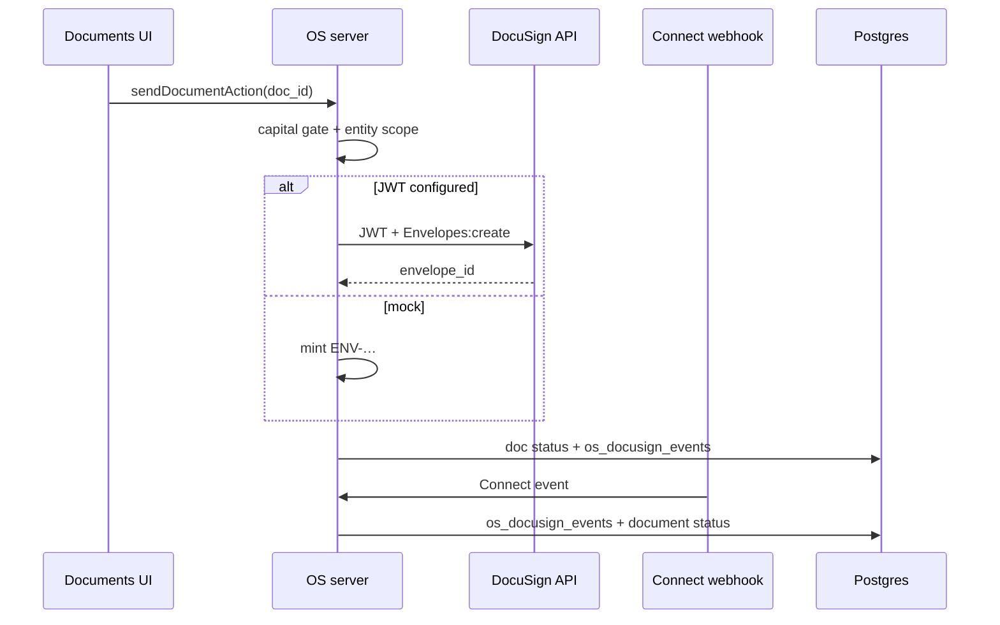

# DocuSign Integration — Architecture (Phase 21)

**Status:** Live JWT send + Connect webhook · hub under Shared Services · Legal.  
**Fallback:** Mock `ENV-…` envelopes when JWT env is incomplete.

## Placement

| Layer | Location |
|-------|----------|
| Product hub | `/shared-services/legal/docusign` |
| Documents send | `sendDocumentViaDocuSign` → Documents UI |
| JWT / envelopes | `tagevc-os/src/lib/docusign/{config,jwt,envelopes,send}.ts` |
| Connect parse | `lib/docusign/connect.ts` |
| Events | `lib/docusign/events-repo.ts` → `os_docusign_events` |
| Webhook | `POST /api/docusign/webhook` |
| SQL | `phase20_docusign_events.sql` + `phase21_shared_services.sql` |

## Flow

## Env matrix

| Variable | Purpose |
|----------|---------|
| `DOCUSIGN_INTEGRATION_KEY` | Integration key |
| `DOCUSIGN_USER_ID` | Impersonated user GUID |
| `DOCUSIGN_ACCOUNT_ID` | Account |
| `DOCUSIGN_PRIVATE_KEY` | JWT RSA private key (PEM; `\n` ok) |
| `DOCUSIGN_OAUTH_HOST` | Default `account-d.docusign.com` |
| `DOCUSIGN_BASE_PATH` | Default `https://demo.docusign.net` |
| `DOCUSIGN_WEBHOOK_SECRET` | Custom header `x-tagevc-webhook-secret` |
| `DOCUSIGN_CONNECT_HMAC_SECRET` | Optional `X-DocuSign-Signature-1` HMAC |
| `DOCUSIGN_VOID_POLICY` | `allow` / `warn_capital` / `block_capital` |

## Webhook payloads

1. **Mock / simple:** `{ "envelope_id": "…", "status": "completed" }`  
2. **Connect JSON:** `{ "event": "envelope-completed", "data": { "envelopeId": "…", "envelopeSummary": { "status": "completed" } } }`

Unknown envelopes are acknowledged and still logged to `os_docusign_events`.

## Permissions

| Action | Permission |
|--------|------------|
| Send non-capital | `write:documents` |
| Send capital | `action:docusign_capital` |
| View hub / events | `read:documents` |

## Phase 24–32 storage & workflows

- Hub: role-map send, **live refresh roles**, void (reason + policy + audit), CoC email, reminders.  
- Independent live/event filters plus subject, recipient, and identifier search.
- Void policy: `DOCUSIGN_VOID_POLICY=allow|warn_capital|block_capital`.  
- Live 30-day envelope status table with management filters.
- Void preflight + irreversible confirmation; replacement envelopes record source lineage.
- Advanced errors expose safe HTTP/code/trace diagnostics.
- Recipient routing status appears in the live envelope list.
- Void intent is written before the irreversible API call; replacement lineage
  is recorded in both directions with actor metadata.
- Template search shows description and cache freshness.
- Apply through `phase29_paid_media_warranty.sql`.  

## Still deferred

- API continuation pagination and a dedicated recipient detail drawer
- Multi-role replacement blueprints
- Retire simulate button in production  

