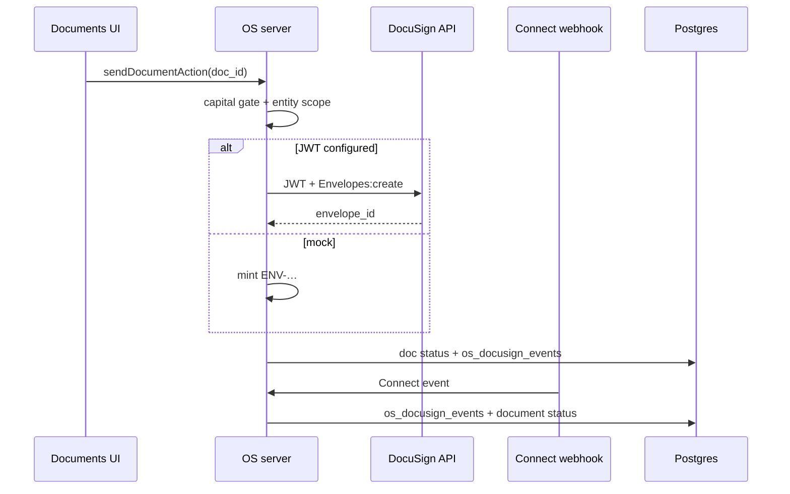

# DocuSign Integration — Architecture (Phase 21)

**Status:** Live JWT send + Connect webhook · hub under Shared Services · Legal.  
**Fallback:** Mock `ENV-…` envelopes when JWT env is incomplete.

## Placement

| Layer | Location |
|-------|----------|
| Product hub | `/shared-services/legal/docusign` |
| Documents send | `sendDocumentViaDocuSign` → Documents UI |
| JWT / envelopes | `tagevc-os/src/lib/docusign/{config,jwt,envelopes,send}.ts` |
| Connect parse | `lib/docusign/connect.ts` |
| Events | `lib/docusign/events-repo.ts` → `os_docusign_events` |
| Webhook | `POST /api/docusign/webhook` |
| SQL | `phase20_docusign_events.sql` + `phase21_shared_services.sql` |

## Flow

## Env matrix

| Variable | Purpose |
|----------|---------|
| `DOCUSIGN_INTEGRATION_KEY` | Integration key |
| `DOCUSIGN_USER_ID` | Impersonated user GUID |
| `DOCUSIGN_ACCOUNT_ID` | Account |
| `DOCUSIGN_PRIVATE_KEY` | JWT RSA private key (PEM; `\n` ok) |
| `DOCUSIGN_OAUTH_HOST` | Default `account-d.docusign.com` |
| `DOCUSIGN_BASE_PATH` | Default `https://demo.docusign.net` |
| `DOCUSIGN_WEBHOOK_SECRET` | Custom header `x-tagevc-webhook-secret` |
| `DOCUSIGN_CONNECT_HMAC_SECRET` | Optional `X-DocuSign-Signature-1` HMAC |

## Webhook payloads

1. **Mock / simple:** `{ "envelope_id": "…", "status": "completed" }`  
2. **Connect JSON:** `{ "event": "envelope-completed", "data": { "envelopeId": "…", "envelopeSummary": { "status": "completed" } } }`

Unknown envelopes are acknowledged and still logged to `os_docusign_events`.

## Permissions

| Action | Permission |
|--------|------------|
| Send non-capital | `write:documents` |
| Send capital | `action:docusign_capital` |
| View hub / events | `read:documents` |

## Still deferred

- Template catalog sync  
- Void / reminder UI  
- Certificate of completion packaging  
- Retire simulate button in production  

## Phase 24 storage

Completed envelopes upload to bucket **`docusign-signed`** (`storage_path` on `os_docusign_signed_files`). Large PDFs omit inline `content_base64`. Hub lists size, storage errors, and signed download URLs. Apply `phase24_maturation.sql`.
