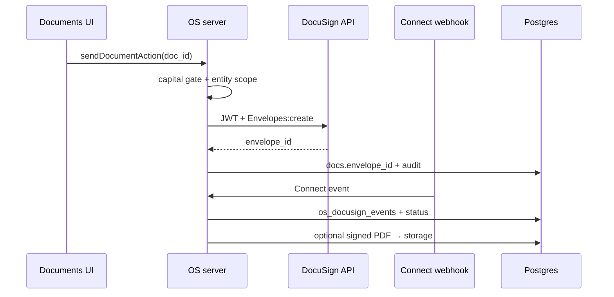

# DocuSign Integration — Architecture (Phase 20)

**Status:** Designed · stub UI under Shared Services · Legal.  
**Non-goal:** Full Connect sync in Phase 20 (mock send/webhook remain).

## Placement

| Layer | Location |
|-------|----------|
| Product hub | Shared Services → Legal → DocuSign |
| Stub route | `/shared-services/legal/docusign` |
| Documents touchpoint | Existing `/documents` send + capital gate |
| Types | `tagevc-os/src/lib/docusign/types.ts` |
| SQL stub | `tagevc-os/supabase/phase20_docusign_events.sql` |

## Goals

1. Replace mock `ENV-…` envelope IDs with real DocuSign envelopes  
2. Connect webhook → durable `os_docusign_events` + document status  
3. Preserve capital-doc human gate (`action:docusign_capital`, forbid-list)  
4. Store completed PDFs into entity folder `07_Signed`  
5. Entity-scope events by `entity_id` for subsidiary operators  

## Current mock path (keep for local/dev)

```
Ready to Send → sendDocument (fake envelope)
  → POST /api/docusign/webhook { envelope_id, status }
  → DocumentRecord status + optional move to 07_Signed
```

Simulate button on document detail remains until real Connect is live.

## Target architecture (Phase 21+)



## Env matrix (planned)

| Variable | Purpose |
|----------|---------|
| `DOCUSIGN_INTEGRATION_KEY` | Integration key |
| `DOCUSIGN_USER_ID` | Impersonated user GUID |
| `DOCUSIGN_ACCOUNT_ID` | Account |
| `DOCUSIGN_PRIVATE_KEY` | JWT RSA key |
| `DOCUSIGN_BASE_PATH` | demo vs production host |
| `DOCUSIGN_WEBHOOK_SECRET` | Already used (custom header) |

Prefer Connect HMAC verification in Phase 21; keep custom secret as fallback.

## Permissions

| Action | Role |
|--------|------|
| Send non-capital | `write:documents` |
| Send capital | `action:docusign_capital` (visionary today) |
| View events | `read:documents` + entity scope |

## Subsidiary usage

- Envelope events carry `entity_id` from the document  
- RLS soft-scope on `os_docusign_events` (firm-wide or `can_access_entity`)  
- Service role webhook path inserts then revalidates  

## Implementation slices (Phase 21+)

1. JWT client + create envelope from template/upload  
2. Connect adapter → `os_docusign_events`  
3. Signed PDF pull → storage + `07_Signed`  
4. Void / reminder / recipient update  
5. Retire simulate button in production  

## Out of scope here

- Full SDK wiring  
- Push notifications on signed  
- Multi-account DocuSign orgs  
