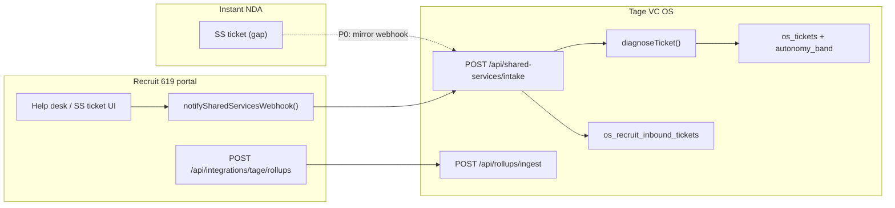

# Cross-OS Automation Audit

**Date:** 2026-07-25  
**Scope:** Tage VC OS (`tagevc-os/`), Recruit 619 portal (`/Users/joshmonroe/Projects/recruit619-portal`), Instant NDA (`/Users/joshmonroe/Projects/InstaNDA`)

**Policy (non-negotiable):** Never target **AUTO** for capital/money movement, DocuSign **send** (Tage capital/HR envelopes), IAM **role grants**, HR **termination**, or **credit-file writes** (disputes, bureau submissions, invented scores). Those stay **ESCALATE** or explicit human confirm (**DRAFT** at best for prep-only).

**Known shipped (not re-audited as greenfield):** Ticket `autonomy_band` AUTO/DRAFT/ESCALATE (`src/lib/shared-services/diagnose.ts`, allow/forbid lists, draft approve/reject UI); Phase 72 HRIS, 73 Net Worth, 74 personal credit dual-person, 75 business credit multi-bureau; SSC checklists; Graph/DocuSign plumbing; marketing autopilot phases.

---

## Autonomy matrix

| OS | Area | Current state (Manual / DRAFT / AUTO) | Proposed target (AUTO / DRAFT / ESCALATE) | Blast radius | Implementation notes | Priority |
|----|------|----------------------------------------|-------------------------------------------|--------------|----------------------|----------|
| Tage | Ticket diagnose loop | **DRAFT/AUTO/ESCALATE** via `diagnoseTicket()`; AUTO v1 **audit-log only** (`src/lib/data/ticket-store.ts` L382–407) | **AUTO** executors for allow-list only; **DRAFT** default for subsidiary intake; **ESCALATE** P0/forbid | Medium (wrong auto-action) | Extend `allow-list.ts` handlers; Phase 76 columns in `supabase/phase76_ticket_ai_diagnose.sql`; keep `forbid-list.ts` server-side | P0 |
| Tage | Shared Services intake (subsidiaries) | **AUTO** ticket create + diagnose on POST (`src/app/api/shared-services/intake/route.ts`); ledger `os_recruit_inbound_tickets` | **AUTO** create/dedupe; **DRAFT** band for legal/finance kinds; set `source_system` recruit619/instantnda | Low–Med | Intake already brands `[R619]` / `[INDA]`; wire `source_system` + `source_ref` on persist (Phase 76) | P0 |
| Tage | SSC checklist cadence | **AUTO** cron (`vercel.json` → `/api/ssc/cadence-worker`) | **AUTO** generate/sync; **AUTO** escalate breaches (`phase54_shared_services_inbox_ops.sql`) | Low | `src/lib/shared-services/ssc-checklist/cadence-runner.ts` | P2 |
| Tage | HRIS cadence (Phase 72) | **AUTO** retime + escalate overdue steps → HR tickets (`src/app/api/hris/cadence-worker/route.ts`, `src/lib/hris/escalate.ts`) | **AUTO** cadence; **DRAFT** for step assists touching Graph/mailbox; **ESCALATE** termination/offboarding | Med | Step assists in `src/lib/hris/step-assists.ts`; DocuSign **ESCALATE** (`src/lib/hris/docusign-step.ts` requires `explicitHumanConfirm`) | P1 |
| Tage | IT onboarding/offboarding scans | **AUTO** cron scans; onboard run gated by `IT_AUTO_ONBOARD` (`src/lib/shared-services/it-onboarding.ts`) | **DRAFT** start runs; **AUTO** status scans + ticket nudges only | Med | Routes: `/api/it/onboarding-status-scan`, `/api/it/offboarding-status-scan`, `/api/it/intune-action-worker` | P1 |
| Tage | Marketing autopilot | **AUTO** schedule, token refresh, engagement pull, paid metrics, revenue ingestion, SLA digest (`vercel.json` crons) | Keep **AUTO** for pulls/schedules; **DRAFT** for publish/send to social | Med | `src/lib/shared-services/marketing-phase48–51.ts`, `/api/marketing/schedule-worker/route.ts` | P2 |
| Tage | DocuSign workers | **AUTO** reminder, reconciliation, archive governance, send-**recovery** (not new capital send) | **AUTO** workers; **ESCALATE** any new envelope send | High | `/api/docusign/*-worker/route.ts`; webhook `/api/docusign/webhook/route.ts` | P2 |
| Tage | Finance IES sync | **AUTO** daily cron (`/api/finance/ies/sync/route.ts`) | **AUTO** sync; **ESCALATE** journal/posting actions | High | `src/lib/ies/sync.ts` | P2 |
| Tage | Net Worth / credit (Ph 73–75) | **Manual** upload + parse; Grok advisor chat **Manual**; parse retry on allow-list | **DRAFT** Grok summaries; **AUTO** `retry_failed_parse` only; **ESCALATE** all credit-file **writes** | High | `src/lib/net-worth/credit-parse.ts`, `business-credit-parse.ts`, `credit-grok.ts`; UI `src/app/(app)/portfolio/net-worth/` | P1 |
| Tage | Deal flow website intake | **AUTO** ingest API (`/api/deal-flow/website-intake/route.ts`) | **DRAFT** lead qualification; **AUTO** route/tag only | Low | `src/lib/deal-flow/website-intake.ts` | P2 |
| Tage | Recruit rollup ingest | **AUTO** when POST with secret (`/api/rollups/ingest/route.ts` → `os_recruit_feed_metrics`) | **AUTO** ingest; **DRAFT** leadership narrative | Low | Bearer `TAGE_ROLLUP_SECRET` | P1 |
| Tage | Subsidiary ticket API (P2) | **AUTO** create with diagnose (`/api/subsidiary/tickets/route.ts`) | Same as intake + entity-scoped auth | Med | `src/lib/multi-sub/subsidiary-ticket-auth.ts` | P1 |
| Tage | Ops / admin crons | **AUTO** SLO evaluate/deliver, soak-health, snapshot retirement | **AUTO** | Low | `/api/ops/slo-*`, `/api/admin/soak-health/route.ts` | P3 |
| Tage | Identity lifecycle (P5) | **Manual** API + checklist (`/api/identity/lifecycle/route.ts`) | **DRAFT** joiner prep; **ESCALATE** leaver revoke | High | `src/lib/multi-sub/lifecycle.ts` | P2 |
| Tage | Instant NDA parent view | **Manual** KPI snapshot (`src/app/(app)/inda-saas/page.tsx`, `src/lib/inda-saas/`) | **AUTO** rollup ingest from INDA (future); **DRAFT** reports | Low | No INDA→Tage metrics worker yet | P2 |
| Recruit 619 | Pipeline stage automation | **AUTO** desk tasks, alerts, send-out stamp (`src/lib/modules/pipeline/stage-automation.ts`) | **AUTO** task spawn; **DRAFT** AI copy | Low | Triggered from `src/app/(app)/candidates/actions.ts` | P2 |
| Recruit 619 | AI assist drafts | **DRAFT** only (`[AI draft — review before use]` in `src/lib/modules/ai/assist.ts`) | Stay **DRAFT** | Low | Grok via `src/lib/think-tank/llm.ts` | — |
| Recruit 619 | Candidate dedupe | **AUTO** merge suggestion ≥0.85; gray zone **Manual** (`src/lib/modules/candidates/dedupe.ts`) | **DRAFT** auto-merge preview; **AUTO** link only at ≥0.95 after review window | Med | `AUTO_MATCH_THRESHOLD = 0.85` | P1 |
| Recruit 619 | Job board feed + apply (JobTarget planned) | **Removed** Appcast scaffolding 2026-08; wire JobTarget when credentials land | **AUTO** ingest target; **DRAFT** duplicate candidate review | Low | Replaces `docs/APPCAST_OPS.md` | P2 |
| Recruit 619 | Shared Services tickets | **Manual** user submit; webhook **AUTO** if env set (`src/lib/modules/shared-services/tickets.ts`, `webhook.ts`) | **AUTO** webhook + Tage diagnose; **DRAFT** for legal/finance subjects | Low | Env: `TAGE_SS_WEBHOOK_URL` → Tage `/api/shared-services/intake` (`docs/PHASE35.md`) | P0 |
| Recruit 619 | Help desk / SS panels | **Manual** create; deep links to Tage (`src/components/shared-services/ss-ticket-panel.tsx`, `/help-desk`) | Same as SS tickets | Low | `src/app/(app)/shared-services/actions.ts` | P0 |
| Recruit 619 | Tage rollups push | **Manual** POST; stub without env (`src/app/api/integrations/tage/rollups/route.ts`, `docs/TAGE_ROLLUPS.md`) | **AUTO** scheduled POST to Tage ingest | Low | Set `TAGE_ROLLUP_API_URL`, `TAGE_ROLLUP_SECRET`; add Vercel cron on portal | P0 |
| Recruit 619 | Saved search alerts | **Manual** toggle; **no email worker** (`docs/PHASE21.md`) | **DRAFT** digest content; **AUTO** send after opt-in | Low | `src/app/(app)/pool/actions.ts`, `r619_search_alerts` | P1 |
| Recruit 619 | Tage presence bridge | **Manual** user (`src/app/api/tage-presence/route.ts`, `tage-presence-bridge.tsx`) | **AUTO** heartbeat optional | Low | Posts to Tage app URL | P3 |
| Recruit 619 | Finance visibility | **Manual** links to Tage Finance (`src/lib/modules/finance/ies-visibility.ts`) | **DRAFT** “open month-end ticket” prefills | Low | No money AUTO | P3 |
| Recruit 619 | Salesforce / exports | **Manual** export routes (`src/app/api/exports/*`) | **AUTO** scheduled export to secure bucket **DRAFT** | Med | Phase exports | P3 |
| Instant NDA | Core NDA sign + email PDF | **AUTO** on user action (`supabase/functions/generate-and-send-nda/`, `send-nda-invite/`) | Stay **AUTO** (product); not Tage forbid-list scope | Med (customer email) | Resend; metering `ndaMetering.ts` | — |
| Instant NDA | Bulk NDA jobs | **AUTO** queue (`process-bulk-job/`, `finalize-bulk-session/`) | **AUTO** processing; **DRAFT** on org overage | Med | `process-bulk-job/index.ts` | P2 |
| Instant NDA | Stripe billing | **AUTO** webhook (`stripe-webhook/`) | **AUTO**; **ESCALATE** refunds/chargebacks | High | `_shared/stripe*.ts` | P2 |
| Instant NDA | Sales CRM automation | **AUTO** stage tasks/emails/drips with toggles (`docs/SALES_AUTOMATION.md`, `_shared/salesAutomation.ts`) | **AUTO** drips; **DRAFT** quote send; **ESCALATE** enterprise contract | Low–Med | Edge: `process-sales-drips`, `update-sales-lead`, UI `/sales/automation` | P2 |
| Instant NDA | Enterprise intake | **AUTO** lead + drip enroll (`request-enterprise/`) | **DRAFT** qualification; **ESCALATE** provision | Med | Creates lead; human closes | P1 |
| Instant NDA | Enterprise provision | **Manual** admin JWT (`provision-enterprise/`) | Stay **ESCALATE** (org + domain grants) | High | Never AUTO role/domain grants | — |
| Instant NDA | Sales digest | **AUTO** with cron secret (`send-sales-digest/`) | **AUTO** | Low | Founder cron setup per `SALES_PLATFORM.md` | P2 |
| Instant NDA | Gusto commissions sync | **AUTO** edge fn (`sync-gusto-commissions/`) | **AUTO** pull; **ESCALATE** payout | High | Money-adjacent | P2 |
| Instant NDA | Tage Shared Services handoff | **Not wired** (no `TAGE_SS_*` in repo); Tage intake ready for `ENT-INDA` | **AUTO** webhook mirror Recruit pattern; **DRAFT** legal tickets | Low | Copy `recruit619-portal` webhook module; entity `ENT-INDA` in Tage intake | P0 |
| Instant NDA | Tage portfolio rollups | **Manual** / parent snapshot only on Tage side | **AUTO** metrics POST (new INDA rollup route) | Low | Symmetry with `TAGE_ROLLUP_*` | P2 |

---

## 1. Existing live automations (by OS)

### Tage VC OS (`tagevc-os/`)

| Automation | Trigger | Entry point |
|------------|---------|-------------|
| Vercel crons (full list) | Schedule | `vercel.json` |
| Marketing schedule / tokens / engagement / paid metrics / revenue / approval SLA | Cron | `src/app/api/marketing/*` |
| DocuSign reminder, reconciliation, archive governance, send recovery | Cron | `src/app/api/docusign/*-worker/route.ts` |
| IT onboarding/offboarding/license scans, Intune action worker | Cron | `src/app/api/it/*` |
| SSC checklist cadence (full, escalate, sync) | Cron | `/api/ssc/cadence-worker` |
| HRIS cadence (full, escalate) | Cron | `/api/hris/cadence-worker` |
| Finance IES sync | Daily cron | `/api/finance/ies/sync` |
| Ops SLO evaluate + deliver | Cron | `/api/ops/slo-evaluate`, `slo-deliver` |
| Admin soak-health, snapshot retirement worker | Cron | `/api/admin/soak-health`, `snapshot-retirement-worker` |
| Ticket diagnose on create | Sync | `src/lib/shared-services/diagnose.ts` + `ticket-store` / SQL tickets |
| Subsidiary intake + rollups ingest | HTTP + secret | `/api/shared-services/intake`, `/api/rollups/ingest` |
| Website deal-flow intake | HTTP | `/api/deal-flow/website-intake` |
| Notifications digest | Cron/manual | `/api/notifications/digest` |
| Exchange litigation hold (optional external) | Env-gated | `EXCHANGE_AUTOMATION_URL` in `src/lib/shared-services/it-mdm.ts` |

### Recruit 619 portal (`recruit619-portal/`)

| Automation | Trigger | Entry point |
|------------|---------|-------------|
| Pipeline stage → desk tasks / alerts / AI draft hook | User stage advance | `src/lib/modules/pipeline/stage-automation.ts` |
| Job board feed + signed apply webhook (JobTarget planned) | External | TBD — Appcast removed 2026-08 |
| AI draft generation (review required) | User | `src/lib/modules/ai/assist.ts` |
| Dedupe scoring (auto-match tier) | Import/merge flows | `src/lib/modules/candidates/dedupe.ts` |
| SS ticket → Tage webhook | On ticket create (if env) | `src/lib/modules/shared-services/webhook.ts` |
| Tage rollup payload build/push | Manual GET/POST | `src/app/api/integrations/tage/rollups/route.ts` |
| Tage presence ping | User | `src/app/api/tage-presence/route.ts` |

### Instant NDA (`InstaNDA/`)

| Automation | Trigger | Entry point |
|------------|---------|-------------|
| Generate PDF + email signed NDA | Signing completion | `supabase/functions/generate-and-send-nda/` |
| NDA invites, bulk processing | API | `send-nda-invite/`, `process-bulk-job/` |
| Stripe subscription lifecycle | Stripe | `stripe-webhook/` |
| Sales stage playbook (email + tasks + drips) | Disposition change | `update-sales-lead/`, `_shared/salesAutomation.ts` |
| Drip processor | Cron or admin button | `process-sales-drips/` |
| Sales digest | Cron or admin | `send-sales-digest/` |
| Enterprise request → lead + drip | Public form | `request-enterprise/` |
| Sales quote send | Admin | `send-sales-quote/` |
| Content generation (Grok) | Admin | `generate-sales-content/` |

---

## 2. Top ROI wins (not already fully AUTO)

Ranked for **low blast radius** and **integration leverage** first.

1. **P0 — Prod Recruit → Tage SS webhook:** Ensure `TAGE_SS_WEBHOOK_URL` + `TAGE_SS_WEBHOOK_SECRET` on portal; every help-desk ticket gets Tage `diagnoseTicket` + durable `os_tickets` row (`intake/route.ts`, `recruit619` `tickets.ts`).

2. **P0 — Recruit rollup cron:** Schedule POST from `recruit619-portal` `/api/integrations/tage/rollups` to Tage `/api/rollups/ingest` (`docs/TAGE_ROLLUPS.md`) so Command Center / firm home metrics stay fresh.

3. **P0 — INDA SS ticket parity:** Add Recruit-style webhook module + help-desk entry in `InstaNDA`; Tage intake already supports `ENT-INDA` branding (`intakeBrand()` in `intake/route.ts`).

4. **P0 — Allow-list AUTO executors (Tage):** Today AUTO only appends audit rows (`ticket-store.ts`); implement real side effects for `tag_ticket_service`, `sla_nudge`, `retry_failed_parse`, `retry_noncritical_webhook` (`allow-list.ts`) with idempotency keys.

5. **P0 — Phase 76 provenance on intake tickets:** Set `source_system` / `source_ref` when persisting subsidiary tickets (`phase76_ticket_ai_diagnose.sql`); enables inbox filtering and metrics (`os_automation_metrics`).

6. **P1 — Recruit saved-search alert worker:** Replace Phase 21 stub with DRAFT email digest → AUTO send after user enables alert (`docs/PHASE21.md`).

7. **P1 — Net worth parse retry job:** Hook allow-listed `retry_failed_parse` to re-run `credit-parse.ts` / `business-credit-parse.ts` on failed rows only (no new bureau writes).

8. **P1 — Dedupe auto-link DRAFT queue:** Recruit619 scores ≥0.85 → create review task instead of silent auto-merge (`dedupe.ts`); after recruiter confirms, AUTO link record.

**Explicitly not recommended for AUTO:** HRIS DocuSign send, Graph mailbox grants, IT offboarding revoke, IES postings, INDA `provision-enterprise`, personal/business credit snapshot **inserts** beyond idempotent re-parse.

---

## 3. Cross-OS handoffs (Recruit / INDA → Tage tickets)

| Handoff | Source | Tage sink | Auth | Status |
|---------|--------|-----------|------|--------|
| Shared Services ticket | Recruit `createSsTicket` | `/api/shared-services/intake` | Bearer `TAGE_SS_WEBHOOK_SECRET` | **Live pattern**; env-dependent |
| Ticket idempotency | Portal `SS-R619-*` id | Same id as `os_tickets.ticket_id` | — | **Live** (`intake/route.ts` L187–207) |
| Inbound ledger | Webhook payload | `os_recruit_inbound_tickets` | Service role | **Live** |
| Operating metrics | Recruit rollups POST | `os_recruit_feed_metrics` | `TAGE_ROLLUP_SECRET` | **Stub/live** by env |
| Subsidiary API (alt) | Any signed client | `/api/subsidiary/tickets` | Subsidiary token | **Live** for P2 clients |
| Instant NDA SS | — | Intake `[INDA]` prefix ready | — | **Not wired in INDA repo** |
| HRIS Recruit link stub | Tage employee ENT-R619 | `src/lib/hris/recruit-hook.ts` | — | **Manual** `pending_link` |
| Finance deep link | Recruit leadership | Tage Finance URL + create-ticket hash | — | **Manual** (`ies-visibility.ts`) |

**Recommended handoff rules**

- Subsidiary tickets: default **P2**, map `kind` → `SsService` (`intake/mapKind`); bump to **ESCALATE** if subject/body hits `forbid-list.ts`.
- Set `source_system` to `recruit619` or `instantnda` and `source_ref` to portal ticket id (Phase 76).
- Attachments: intake uploads to `os-uploads` help-desk prefix (screenshot/document data URLs).
- Rollups: do not open tickets; feed Command Center / entity OS only unless KPI SLO breach (future **DRAFT** summary ticket).

---

## 4. Reference paths

| OS | Root path |
|----|-----------|
| Tage VC OS | `/Users/joshmonroe/Projects/tagevc-sales/tagevc-os` |
| Recruit 619 portal | `/Users/joshmonroe/Projects/recruit619-portal` |
| Instant NDA | `/Users/joshmonroe/Projects/InstaNDA` |

**Tage ticket policy core:** `src/lib/shared-services/diagnose.ts`, `allow-list.ts`, `forbid-list.ts`, UI `src/app/(app)/shared-services/tickets/[ticketId]/page.tsx`, firm queue `src/lib/firm-ops/firm-home.ts`.

**Recruit integration docs:** `docs/PHASE35.md`, `docs/PHASE34.md`, `docs/TAGE_ROLLUPS.md`.

**INDA sales automation docs:** `docs/SALES_AUTOMATION.md`, `docs/SALES_PLATFORM.md`.

---

*Audit method: static code review of routes, workers, edge functions, and phase SQL. No deployments performed.*
